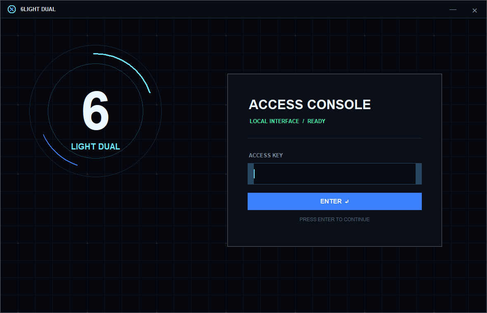
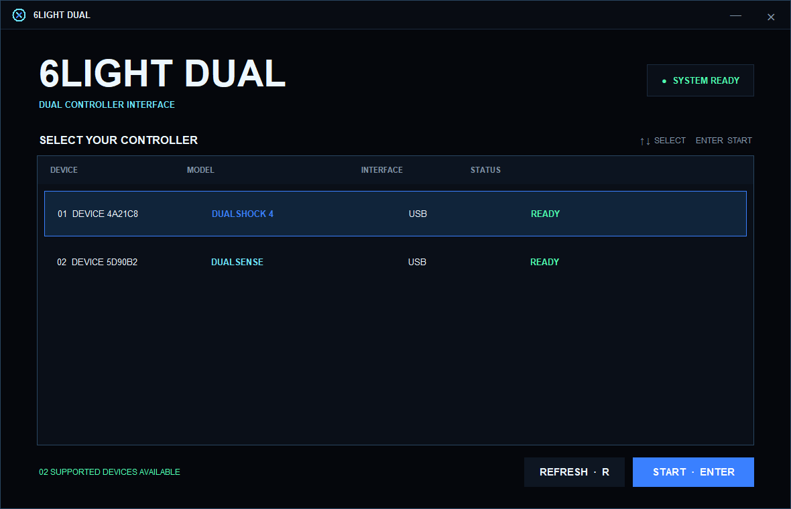
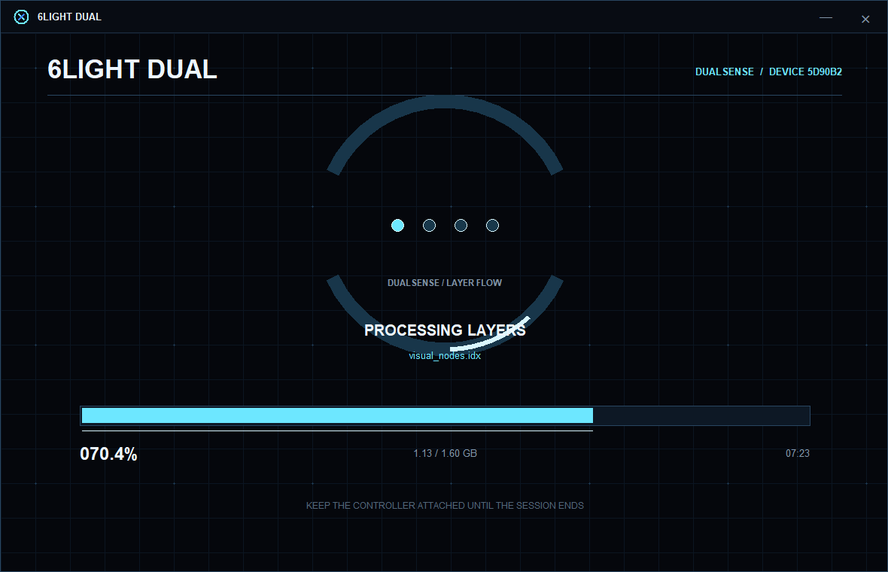
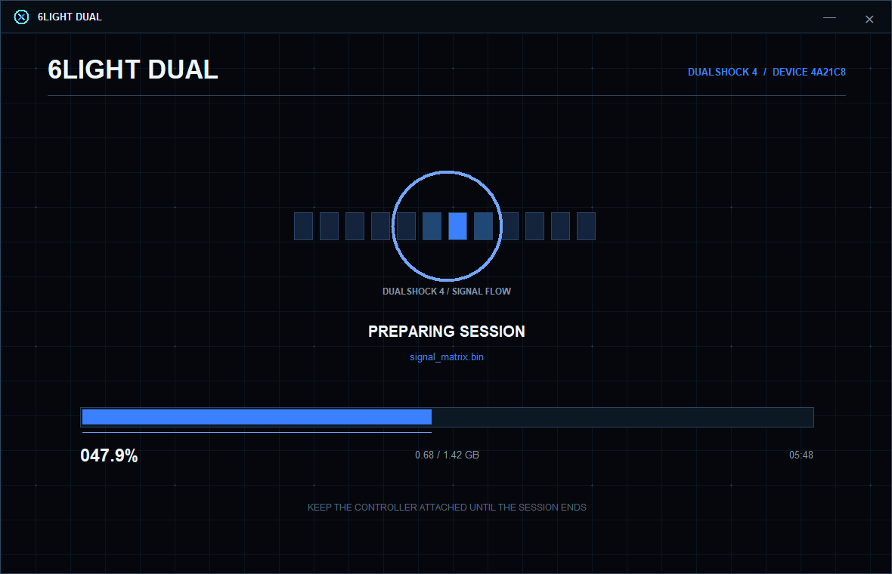
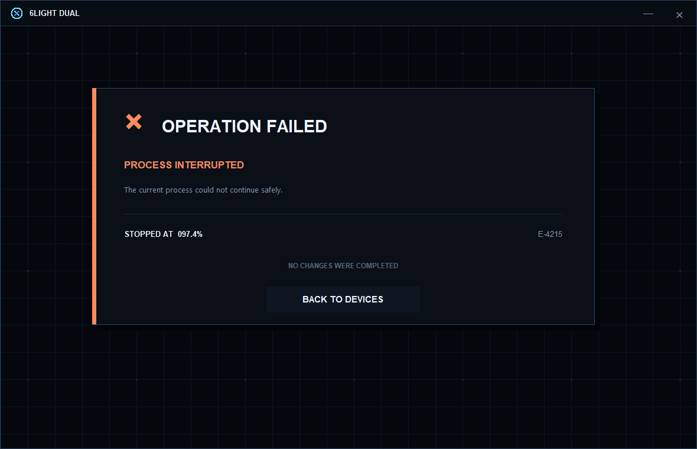

# 🎮 6LIGHT DUAL

**6LIGHT DUAL** is a tool designed for supported controllers that reduces the controller's light count from **30 lights to 6 lights**.

The application detects supported controllers connected via USB. After selecting your controller, you can start the process of reducing the light count.

## 📸 Screenshots

### Access Console

### Controller Selection

### DualSense Session

### DualShock Session

### Process Result

## ✨ How It Works

Using **6LIGHT DUAL** is simple:

1. Connect your controller to your computer via **USB**.
2. Launch **6LIGHT DUAL**.
3. Select the detected controller from the list.
4. Press `Enter` to start the process.
5. The application reduces the controller's light count from **30 to 6**.
6. The complete process takes approximately **10–15 minutes**.
7. Do not disconnect the controller or close the application until the process is complete.

## ⌨️ Controls

| Key | Action |
| --- | --- |
| `Enter` | Continue / Start the process |
| `↑ / ↓` | Select a controller |
| `R` | Refresh the connected controller list |
| `Esc` | Exit the application |

## 🔑 Access

The **Access** field is optional.

If you don't have an Access value, simply leave the field empty and press `Enter` to continue.

## 🔌 Controller Detection

**6LIGHT DUAL** detects supported controllers connected to your system through the Windows Device Inventory.

If your controller doesn't appear in the list, check the USB connection and press `R` to refresh the device list.

## ⏳ Processing Time

The **30 Light → 6 Light** process usually takes approximately **10–15 minutes**.

During the process:

- Do not disconnect the controller from USB.
- Do not close the application.
- Do not shut down or restart your computer.
- Wait until the operation is fully completed.

## 💻 Requirements

- **Windows**
- A supported controller
- **USB** cable and connection

---

### 📦 Version

**6LIGHT DUAL v1.1**
